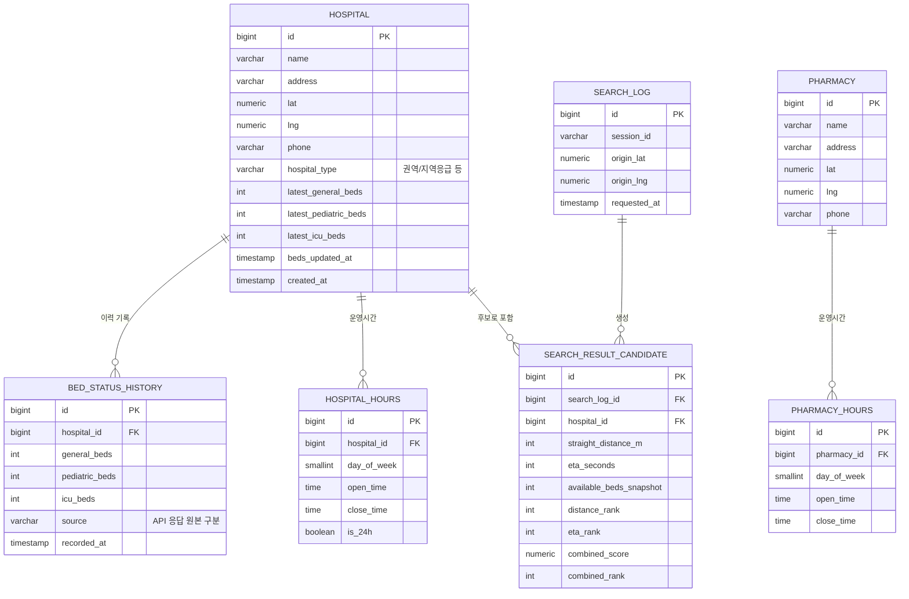

# ERD

병원 정적 정보와 병상 이력을 분리한 이유:

1. 병상현황은 60초 단위로 계속 갱신되는 시계열 데이터라 이력이 남아야 한다.
2. "직선거리 순위 ↔ 시간순 순위가 역전되는 사례"를 정량적으로 수집해야 한다는
   기획 목표(목표 2, 3)를 위해 검색 시점의 스냅샷을 별도로 저장한다.

## 테이블별 메모

| 테이블 | 역할 | 관련 기능 |
|---|---|---|
| `hospital` | 병원 마스터 정보 + 최신 병상 수를 비정규화해 얹어둠. 조회 때마다 이력 테이블을 훑지 않게 하려는 목적 (P95 1.5초 목표). | 기능 ① |
| `bed_status_history` | 병상현황 스냅샷 이력. 갱신 지연 감시, 추후 통계용. | 기능 ①, 목표 6 |
| `hospital_hours` / `pharmacy_hours` | 요일별 진료시간 + 24시간 여부. 공휴일 판정은 특일정보 API 응답과 조합. | 기능 ④ |
| `search_log` / `search_result_candidate` | 검색 1회당 후보 병원들의 거리순위·시간순위·결합점수를 함께 저장. "역전 사례 정량 수집"의 실제 데이터 소스. | 기능 ③, 목표 2·3 |

## 반경검색에 대한 메모

`lat`/`lng`는 PostgreSQL 기본 `numeric(9,6)`으로 시작해도 되지만, 반경검색에
`ST_DWithin`을 쓰려면 PostGIS 확장 + `geography(Point)` 컬럼과 GiST 인덱스를
초반에 붙이는 걸 권장한다. 나중에 붙이면 마이그레이션이 커진다.

지금 스캐폴드의 `HospitalService.findNearby()`는 PostGIS를 아직 안 붙인 상태라
자바에서 Haversine 공식으로 임시 계산한다 — 병원 수가 늘어나기 전에 DB 레벨
필터링으로 옮기는 걸 TODO로 남겨뒀다.
